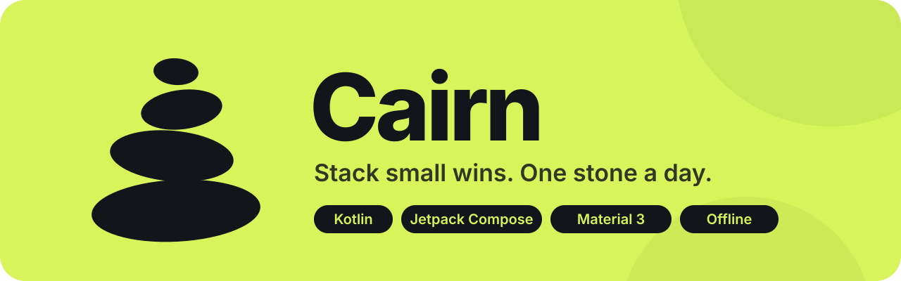
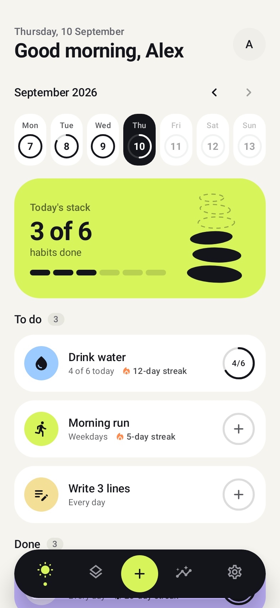
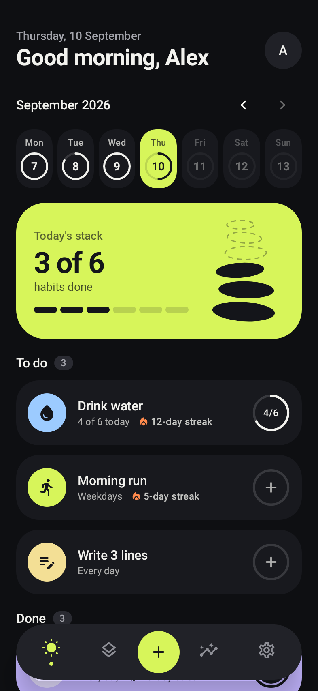
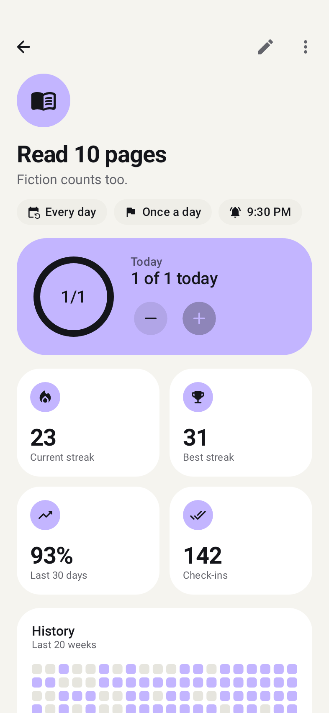
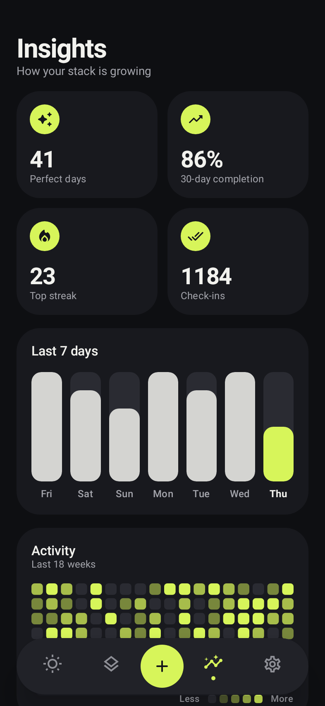
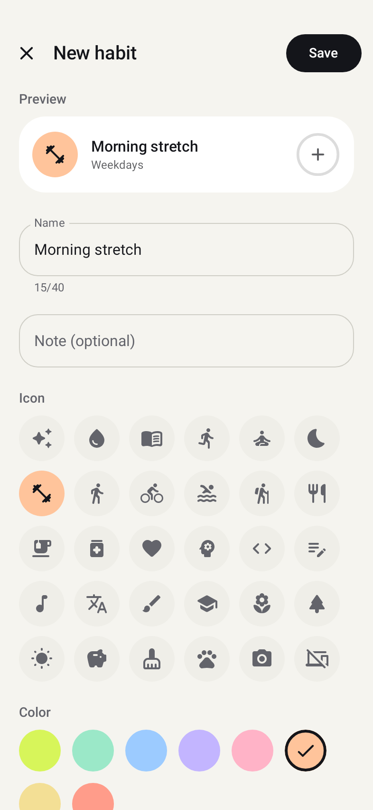
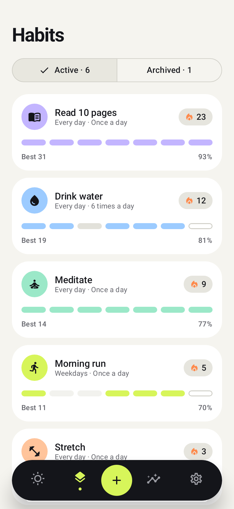
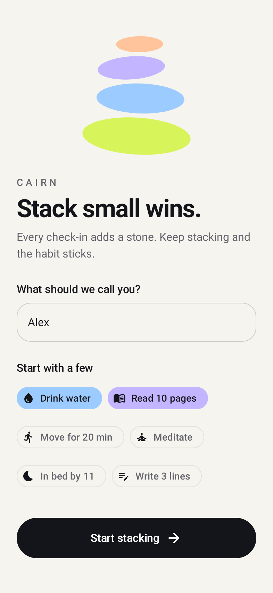
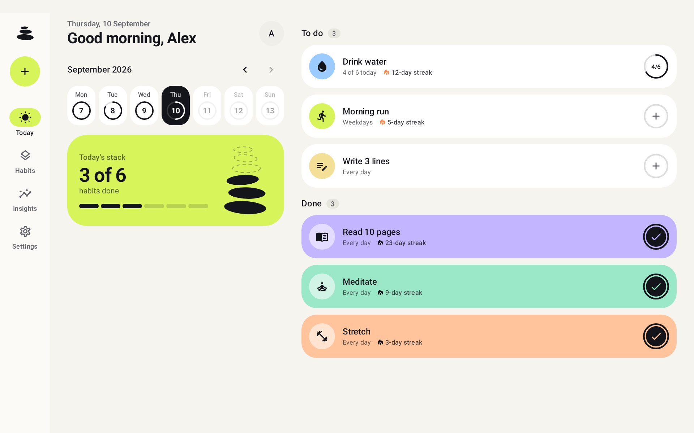

<p align="center">
  
</p>

<p align="center">
  <a href="https://github.com/CodingfulAlt/Cairn/releases"></a>
  
  
  
</p>

**Cairn** is a simple, beautiful, and privacy-focused habit tracker for Android.

Hikers stack cairns one stone at a time to mark their trail. Cairn works the same way: every check-in adds a stone, helping you build lasting habits through small daily wins.

* **100% Private & Offline** — No accounts, no data collection, and no internet required.
* **No Ads or Subscriptions** — Completely free and open source.
* **Designed for Android** — Built with Material 3, fully supporting dark mode, dynamic colors, phones, foldables, and tablets.

---

## Screenshots

| Today | Dark Mode | Habit Details | Insights |
| :---: | :---: | :---: | :---: |
|  |  |  |  |

| New Habit | All Habits | Onboarding |
| :---: | :---: | :---: |
|  |  |  |

On tablets and foldable devices in landscape mode, Cairn adapts into a multi-column view with a navigation rail:

<p align="center">
  
</p>

---

## Features

- **Today View** — See your daily progress at a glance with a stone stack that grows as you complete habits. Finish everything for a celebratory confetti animation!
- **Simple Check-Ins** — Tap to mark complete, or long-press to undo. Habits can have numeric daily targets (e.g., drink 6 glasses of water) with visual progress rings.
- **Flexible Schedules** — Set habits for daily routines, weekdays, weekends, or specific days of the week. Rest days won't break your streaks.
- **Detailed Habit Stats** — View current streaks, best streaks, completion rates, and a 20-week activity heatmap for every habit.
- **Overall Insights** — Track total perfect days, view 7-day progress charts, complete heatmaps, and a streak leaderboard across all your habits.
- **Smart Reminders** — Get timely reminders with a "Done" button right in the notification. Turn on an optional evening reminder that only alerts you if habits are left unfinished.
- **Past Day Editing** — Missed logging yesterday? Easily edit past days directly from the week strip.
- **Customization** — Personalize your habits with 30 icons and 8 color themes. Light, dark, and system theme options included.
- **Multi-Language** — Available in English and Bulgarian, with per-app language selection support.

---

## Download & Installation

You can download the latest version of Cairn directly from the [Releases](https://github.com/CodingfulAlt/Cairn/releases) section.

1. Download the `.apk` file from the latest release page.
2. Open the file on your Android device to install it.

---

## Roadmap

- [ ] Home screen widgets
- [ ] Backup & restore (export / import data)
- [ ] Notes for individual check-ins
- [ ] Wear OS companion tile

---

## Building from Source

If you prefer to build the app yourself:

1. Clone the repository:
   ```bash
   git clone https://github.com/CodingfulAlt/Cairn.git
   ```
2. Open the project in **Android Studio Otter (2025.2.1+)** with **JDK 17+**.
3. Run or assemble the debug APK:
   ```bash
   ./gradlew installDebug
   ```

---

## Author

Created by [CodingfulAlt](https://github.com/CodingfulAlt).
