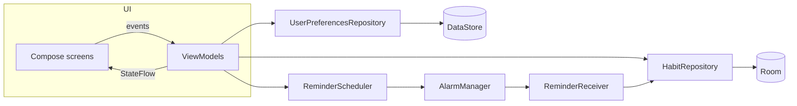

<p align="center">
  
</p>

<p align="center">
  <a href="https://github.com/CodingfulAlt/Cairn/actions/workflows/ci.yml"></a>
  
  
  
</p>

**Cairn** is a habit tracker for Android. Hikers stack cairns one stone at a time to mark the trail, and that's the idea here too: every check-in adds a stone, and small daily wins pile up into something that lasts.

It's fully offline, has no account and no ads, and runs on phones, foldables and tablets.

## Screenshots

| Today | Dark mode | Habit details | Insights |
| :---: | :---: | :---: | :---: |
|  |  |  |  |

| New habit | Habits | Onboarding |
| :---: | :---: | :---: |
|  |  |  |

On tablets and in landscape the bottom bar turns into a navigation rail and screens switch to two columns:


The screenshots are rendered straight from the app's composables by the screenshot tests, so they always match the code.

## Features

- **Today view** with a week strip, a progress card and a little stone stack that grows as you check habits off. Finish everything and you get confetti.
- **Tap to check in, long press to undo.** Habits can have a daily goal (drink water 6 times) and the ring fills up as you go.
- **Flexible schedules**: every day, weekdays, weekends or any days you pick. Days off never break a streak.
- **Streaks, best streaks and completion rates** for every habit, plus a 20 week activity heatmap.
- **Insights** across all habits: perfect days, a 7 day chart, an 18 week heatmap and a streak leaderboard.
- **Reminders** per habit with a "Done" button right in the notification, and an optional evening check-in that only shows up if something is still open.
- **Past days can be edited** from the week strip, in case you forgot to log something yesterday.
- **30 icons and 8 colors**, archive instead of delete, share a habit.
- **Light and dark theme**, or follow the system.
- **English and Bulgarian**, with per-app language support on Android 13+.
- **Adaptive layout** for phones, foldables, tablets and landscape.

## Tech stack

| | |
| --- | --- |
| Language | Kotlin 2.3 |
| UI | Jetpack Compose, Material 3, Navigation Compose (type-safe routes) |
| Architecture | MVVM with unidirectional data flow, `StateFlow` UI state |
| DI | Hilt (KSP) |
| Storage | Room for habits and check-ins, DataStore for preferences |
| Background | AlarmManager + broadcast receivers, re-armed after reboot and time changes |
| Testing | JUnit, kotlinx-coroutines-test, Robolectric + Roborazzi screenshot tests, Room instrumented tests |
| Tooling | Gradle version catalog, ktlint, Android Lint, R8, LeakCanary (debug), GitHub Actions |

## Architecture



Screens only talk to their ViewModel. ViewModels combine repository flows into a single immutable UI state. Streak and progress math lives in plain Kotlin (`core/domain`) so it's easy to unit test without Android.

## Project structure

```
app/src/main/kotlin/io/github/codingfulalt/cairn
├── CairnApplication.kt, MainActivity.kt
├── core
│   ├── common        app-wide coroutine scope, clock
│   ├── data          repositories and their Hilt bindings
│   ├── database      Room database, entities, DAOs
│   ├── designsystem  theme, colors, type, reusable components
│   ├── domain        streaks, daily progress, reminder timing
│   ├── model         plain Kotlin models
│   ├── notifications notifier, alarm scheduler, receivers
│   └── ui            shared composables and formatting helpers
├── feature
│   ├── onboarding
│   ├── today
│   ├── habits
│   ├── detail
│   ├── editor
│   ├── insights
│   └── settings
├── navigation        routes, top-level destinations, NavHost
└── ui                app shell: bottom bar, navigation rail
```

## Getting started

You need **Android Studio Otter (2025.2.1) or newer** and **JDK 17+** (the one bundled with Android Studio works).

1. Clone the repo
   ```bash
   git clone https://github.com/CodingfulAlt/Cairn.git
   ```
2. Open the folder in Android Studio and let Gradle sync.
3. Pick an emulator or a device and press **Run**.

From the command line:

```bash
./gradlew installDebug
```

The debug build installs as `io.github.codingfulalt.cairn.debug`, so it can live next to a release build.

## Tests and checks

```bash
./gradlew testDebugUnitTest         # unit and screenshot tests
./gradlew recordRoborazziDebug      # re-render the images in docs/screenshots
./gradlew connectedDebugAndroidTest # Room tests, needs a device or emulator
./gradlew ktlintCheck lintDebug     # code style and Android Lint
```

The same checks run on every push and pull request through GitHub Actions.

## Release builds

Signing info never goes into the repo. Copy `keystore.properties.example` to `keystore.properties`, fill it in and point it at your keystore, then:

```bash
./gradlew assembleRelease
```

Without that file the release APK is built unsigned. Signed APKs are published on the [Releases](https://github.com/CodingfulAlt/Cairn/releases) page.

## Roadmap

- Home screen widget
- Export and import backups
- Notes on individual check-ins
- Wear OS tile

## Author

Made by [CodingfulAlt](https://github.com/CodingfulAlt).
