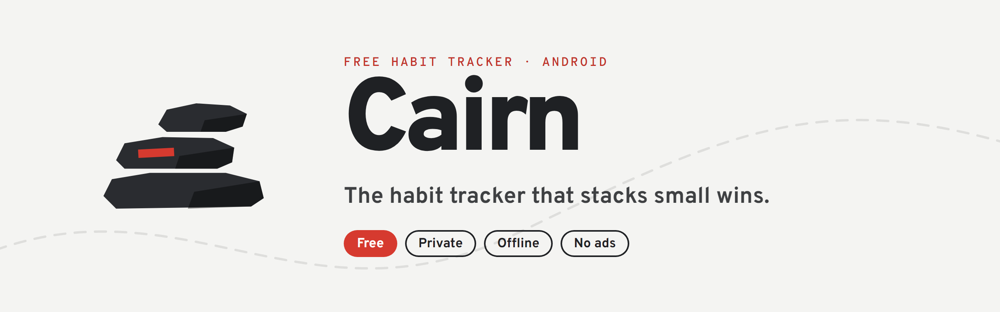
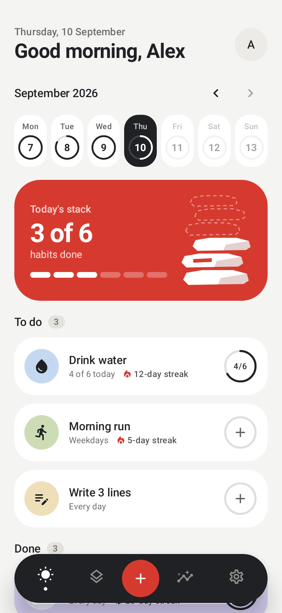
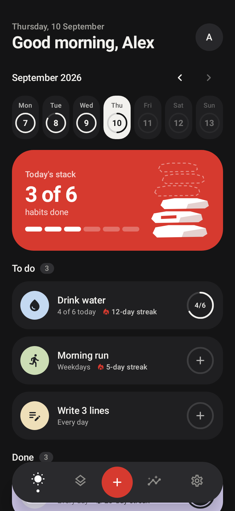
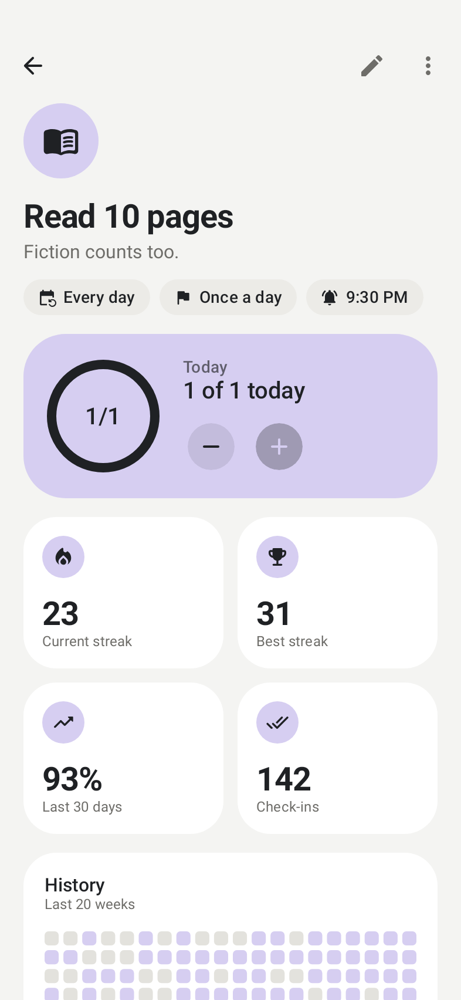
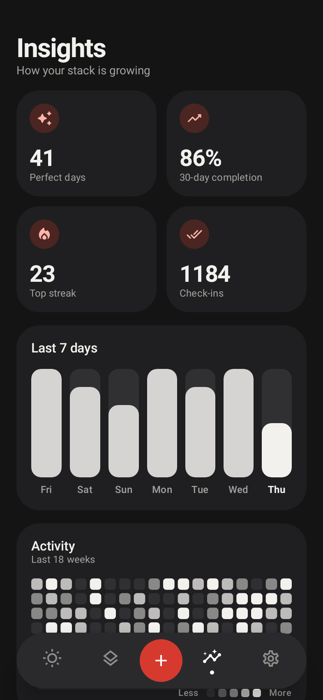
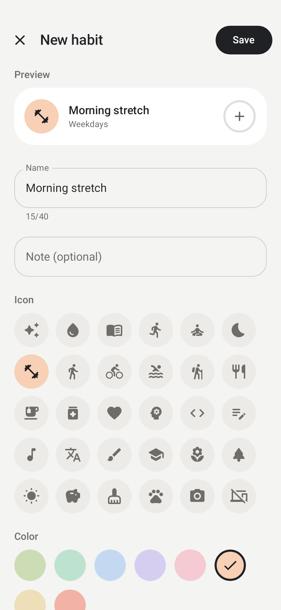
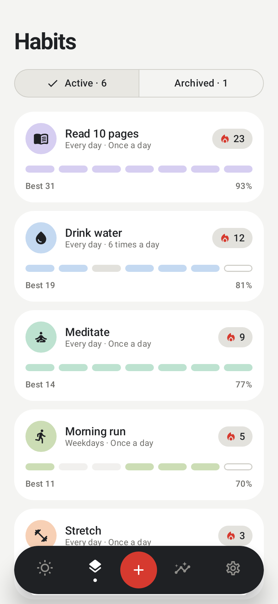
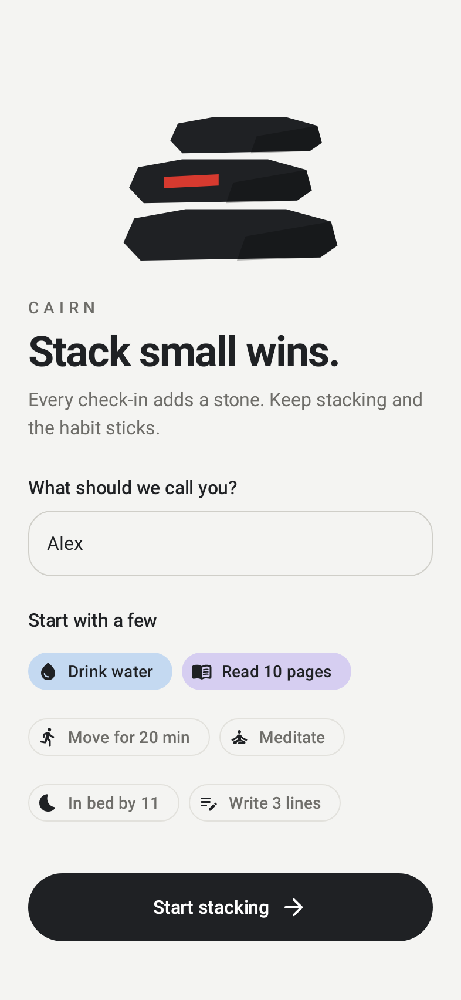
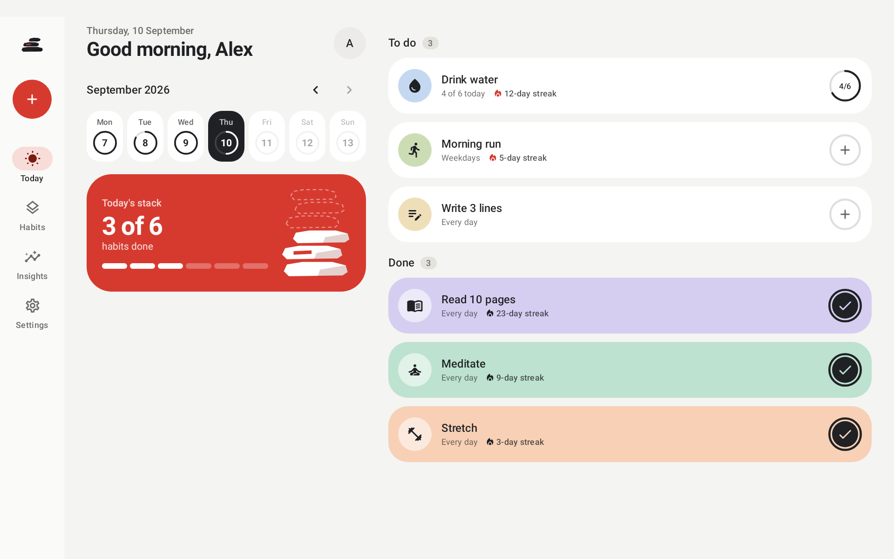
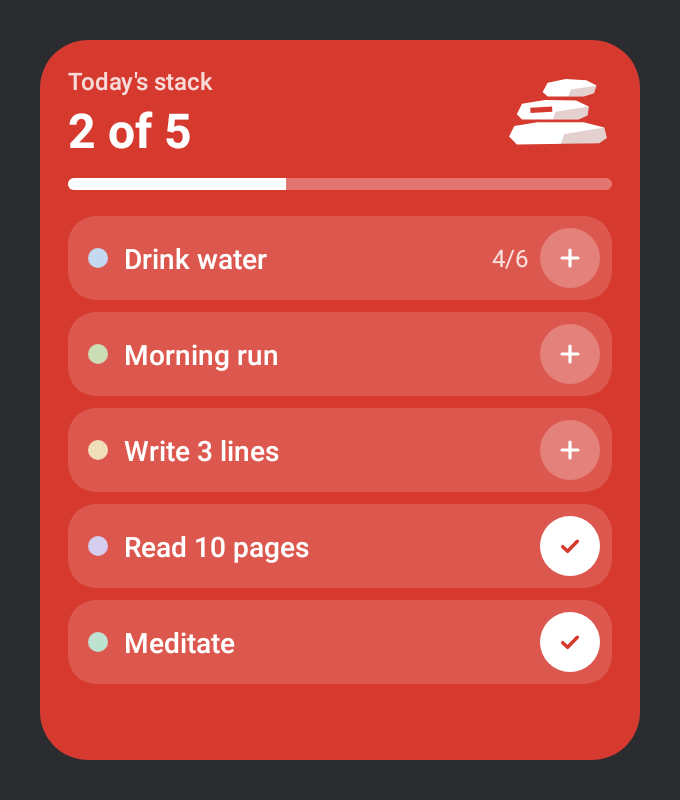

  <picture>
    <source media="(prefers-color-scheme: dark)" srcset="docs/assets/banner-dark.png">
    
  </picture>

  
  
  
  
  
  

> **Beta Notice:** Cairn is currently in active development. While tested for stability, bugs or unexpected behavior may occur.

**Cairn** is a simple, beautiful, and privacy-focused habit tracker built exclusively for **Android** devices (phones, foldables, and tablets).

Hikers stack cairns one stone at a time and paint red marks on the rocks to show the way. Cairn works the same way: every check-in adds a stone, helping you build lasting habits through small daily wins.

- **Android Only** - Tailored natively for Android (requires Android 8.0 / minSdk 26 or newer).
- **100% Private & Offline** - No accounts, no data collection, and the app doesn't even ask for internet access.
- **No Ads or Subscriptions** - Completely free to use with zero advertisements.
- **Modern UI** - Built with Material 3, with light and dark themes and layouts for phones, foldables, and tablets.

---

## Download for Android

Get the newest version from the [website](https://cairn.leap-ops.com/) or straight from GitHub:

[**Download the latest Android APK**](https://github.com/CodingfulAlt/Cairn/releases/latest)

1. Download the `.apk` file onto your Android device.
2. Open it and follow the prompts to install. If Android asks, allow installs from your browser for this file.

---

## Screenshots

| Today | Dark Mode | Habit Details | Insights |
| :---: | :---: | :---: | :---: |
|  |  |  |  |

| New Habit | All Habits | Onboarding |
| :---: | :---: | :---: |
|  |  |  |

On Android tablets and foldables in landscape mode, Cairn adapts into a multi-column view with a navigation rail:

  

The home screen widget shows today's stack and lets you check in with the + button:

  

---

## Features

- **Today View** - See daily progress with a stone stack that grows as habits are completed. Finish everything for a confetti reward animation!
- **Simple Check-Ins** - Tap to mark complete, or long-press to undo. Set daily targets (e.g., drink 6 glasses of water) with visual progress rings.
- **Flexible Schedules** - Track daily routines, weekdays, weekends, or specific days of the week. Rest days won't break your streaks.
- **Detailed Stats** - View current streaks, best streaks, completion rates, and a 20-week activity heatmap for every habit.
- **Overall Insights** - Track total perfect days, view 7-day progress charts, heatmaps, and a streak leaderboard across all habits.
- **Smart Reminders** - Get Android notifications with a quick "Done" button, plus an optional evening check-in reminder.
- **Home Screen Widget** - See today's stack on your home screen and check in with the + button without opening the app.
- **Backup & Restore** - Export your habits and history to a file and restore them on a new phone. The file stays wherever you save it.
- **Past Day Editing** - Easily edit past days directly from the week strip if you forgot to log yesterday.
- **Customization** - Personalize habits with 30 icons, 8 colors, and light/dark mode support.
- **Multi-Language** - Available in English and Bulgarian, with per-app language selection support (Android 13+).

---

## License

Cairn is **source available**, not open source. The code is public so anyone can read it and check how the app handles their data, and the official builds are free for everyone. Copying, modifying, building or republishing the code, graphics or logo is not allowed without written permission. See [LICENSE](LICENSE) for the full terms.

---

## Roadmap

- [x] Home screen widgets
- [x] Backup & restore (export / import data)
- [ ] Notes for individual check-ins
- [ ] Wear OS companion tile

---

## Privacy Policy

Cairn is designed with complete user privacy in mind:

- **100% Local Storage** - All habit entries, check-ins, and user settings are stored exclusively inside a local database on your Android device.
- **No Network Traffic** - The application operates completely offline and does not transmit data to any external server or cloud service.
- **No Cloud Backup** - Habit data is kept out of Google's automatic cloud backup. Moving to a new phone with Android's device-to-device transfer still works, or export a backup file yourself from Settings.
- **Zero Data Collection** - No personal information, usage analytics, or crash reports are tracked, collected, or shared.

---

© 2026 <a href="https://leap-ops.com">LeapOps</a>. All rights reserved.

